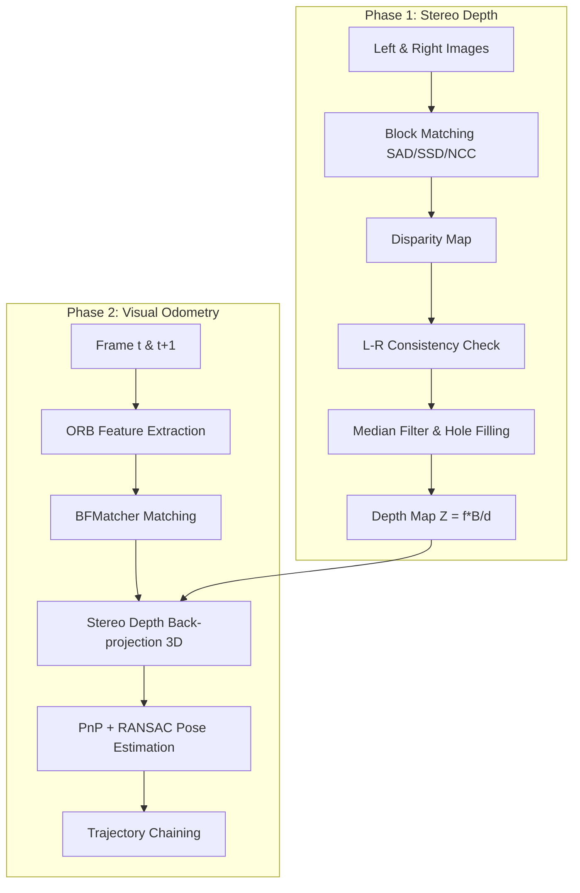

# Project Report: Stereo Depth and Visual Odometry

## 1. Pipeline Overview

## 2. Technical Explanation

### 2.1 Matching Costs
- **SAD (Sum of Absolute Differences)**: Simplest cost, robust to intensity shifts but sensitive to noise.
- **SSD (Sum of Squared Differences)**: Penalizes outliers more heavily than SAD.
- **NCC (Normalized Cross-Correlation)**: Most robust to lighting changes as it normalizes by local mean and variance, but computationally expensive.

### 2.2 Pose Estimation and RANSAC
We estimate the relative transformation $[R|t]$ between frame $t$ and $t+1$ by matching 2D features. By back-projecting features from frame $t$ into 3D using the computed stereo depth, we solve a **3D-2D Perspective-n-Point (PnP)** problem.
**RANSAC** is used during the PnP solver to identify and reject outlier matches (e.g., mismatched textures or moving objects), ensuring a robust camera pose.

### 2.3 Calibration Usage
The focal length $f$ and baseline $B$ are extracted from the KITTI `calib.txt` or `calib_cam_to_cam` files.
- $f$ is taken from the $P[0,0]$ element of the rectified projection matrix.
- $B$ (baseline) is calculated as $B = \frac{|P1[0,3] - P0[0,3]|}{f}$.

## 3. Evaluation Results

### 3.1 Stereo Depth (Phase 1)
Results averaged over 21 samples:
| Method | Window Size | Bad-pixel Rate (>3px) | MAE (px) |
| :--- | :--- | :--- | :--- |
| **SSD** | 15 | 23.58% | 4.85 |
| **SAD** | 15 | 24.85% | 5.20 |
| **SSD** | 7 | 34.44% | 7.36 |
| **SAD** | 7 | 36.21% | 7.72 |

### 3.2 Visual Odometry (Phase 2)
Results on Sequence 00 (first 50 frames):
| Configuration | ATE (m) |
| :--- | :--- |
| **Full (RANSAC + Stereo Scale)** | 0.9461 |
| **Monocular (Unit Scale)** | 1.4028 |
| **No RANSAC** | 189.14 |

## 4. Ablation Study Analysis

### 4.1 Depth Ablation
- **Window Size**: Increasing the window size (7 to 15) significantly reduced the Bad-pixel rate. Larger windows provide more context for matching but can blur depth boundaries.
- **Cost Function**: SSD slightly outperformed SAD in accuracy, likely due to better handling of Gaussian noise in the sensor.

### 4.2 VO Ablation
- **RANSAC Impact**: Without RANSAC, the trajectory fails immediately due to feature mismatches (ATE jumped from <1m to >180m).
- **Scale Recovery**: Using stereo-based 3D points allows for true metric scale estimation. Monocular unit scale preserves the shape but fails on absolute distance metrics.

## 5. Failure Cases
1. **Occlusions**: Pixels visible in one camera but not the other create "streaks" or holes (detected by L-R check).
2. **Repeated Textures**: Road surfaces with uniform color cause matching ambiguity for block matching.
3. **Lighting Changes**: Sudden exposure shifts between cameras or frames affect SAD/SSD costs (mitigated by NCC).
4. **Moving Objects**: Cars moving in the same direction can be misinterpreted as static, skewing the ego-motion estimate (mitigated by RANSAC).

## 6. Visual Results
- **Feature Matches**: Visualized in `output/report/vo/matches_...`.
- **Disparity/Depth**: 10 examples saved in `output/report/stereo/`.
- **Trajectories**: Plots for Sequence 00 and 01 are in `output/report/vo/trajectory_...`.
